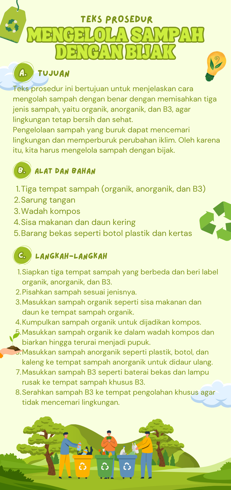
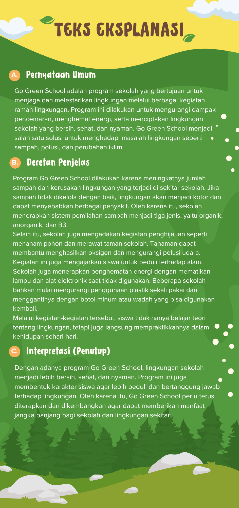

# 🌱 Go Green School Web

Selamat datang di **Go Green School Web** — sebuah website edukasi lingkungan berbasis Laravel yang dirancang untuk membangun kebiasaan peduli bumi melalui pendekatan yang informatif, modern, dan mudah dipahami.

Project ini menghadirkan kombinasi antara **konten edukatif**, **UI interaktif**, dan **fitur kalkulator sampah berbasis data** agar siswa, guru, dan komunitas sekolah dapat belajar sekaligus beraksi nyata untuk lingkungan.

🔗 **Live Demo**: https://gogreenschool-main-svl9z8.free.laravel.cloud/  
🎬 **Konten Video Medsos**: https://www.instagram.com/reel/DWjIx3Tk_bs/?igsh=MW8wNm53MjlleHFwcA==

---

## ✨ Fitur Utama Website

- 🎨 Desain antarmuka modern dengan animasi interaktif
- 🌍 Dukungan bahasa ganda (Indonesia & English)
- 📚 Materi edukasi lengkap (explanation text, procedure text, description text, about text)
- ♻️ Informasi program sekolah hijau (pengelolaan sampah, konservasi air, energi hijau, dll)
- 📊 Kalkulator sampah dengan perhitungan otomatis + visual chart
- 🧾 Riwayat data kalkulator (local storage) + export CSV
- 📩 Contact page dengan integrasi pengiriman email
- 📱 Navigasi responsif (desktop & mobile) + tombol scroll naik/turun
- 👨‍💻 Modal profil developer di halaman utama

---

## 🗂️ Halaman Website

### 1) Home (`/`)
- Hero carousel dan section edukasi utama
- Penjelasan gerakan Go Green School
- Konten **explanation text**
- CTA ke halaman Program, Contact, dan Kalkulator

### 2) About (`/about`)
- Cerita, visi, misi, dan nilai Go Green School
- Konten **about us text** dan **description text**
- Ringkasan tujuan website

### 3) Program (`/program`)
- Daftar program hijau sekolah
- Konten **procedure text** (langkah pengelolaan sampah dan daur ulang)
- Panduan implementasi program berkelanjutan

### 4) Contact (`/contact`)
- Kontak email & Instagram
- Form kirim pesan ke admin
- FAQ + informasi komunikasi sekolah

### 5) Kalkulator (`/kalkulator`)
- Input data sampah organik, anorganik, dan B3
- Hitung total, rata-rata, persentase, prediksi 30 hari
- Visualisasi grafik (Chart.js)
- Simpan, lihat, hapus, gabung data, dan export CSV

---

## 👥 Pembagian Tugas Tim

Berikut rincian kontribusi tiap anggota tim dalam project **Go Green School**:

- **Richard**
   - Berkontribusi dalam penyempurnaan fitur website, khususnya pada peningkatan tampilan interaktif dan perbaikan komponen antarmuka agar pengalaman pengguna lebih nyaman.
   - Menyusun dan menempatkan konten pada bagian _explanation text_ agar pesan edukasi lingkungan tersampaikan dengan bahasa yang jelas dan mudah dipahami.
   - Mendesain **poster Digital Marketing versi 1** sebagai materi promosi utama project Go Green School.
   - Terlibat dalam pembuatan **video konten media sosial** untuk mendukung publikasi website.

- **Irene**
   - Bertanggung jawab pada penyusunan konten bagian _procedure text_, termasuk alur langkah pengelolaan sampah dan implementasi kebiasaan hijau di lingkungan sekolah.
   - Menyiapkan **poster Bahasa Indonesia** dengan fokus pada kekuatan pesan, kerapian tata bahasa, dan kesesuaian materi kampanye.
   - Berpartisipasi dalam produksi **video konten media sosial** agar materi edukasi lebih menarik bagi audiens pelajar.

- **Deny**
   - Mengembangkan konten pada bagian _about us text_ untuk memperkuat identitas, tujuan, dan nilai utama dari website Go Green School.
   - Berkolaborasi dalam pembuatan **poster Digital Marketing versi 2**, terutama pada penyusunan konsep pesan dan visual pendukung.
   - Mendukung proses pembuatan **video konten media sosial** sebagai media kampanye digital project.

- **Dicky**
   - Menjadi penanggung jawab utama pengembangan website, mencakup struktur halaman, integrasi fitur, serta penyesuaian tampilan agar berjalan optimal di desktop dan mobile.
   - Menyusun konten bagian _description text_ untuk memberikan informasi inti website secara ringkas, informatif, dan terarah.
   - Berkolaborasi dalam pembuatan **poster Digital Marketing versi 2** bersama tim untuk memastikan konsistensi branding.
   - Turut memproduksi **video konten media sosial** sebagai bagian dari strategi promosi Go Green School.

---

## 🖼️ Dokumentasi Poster

### Poster Digital Marketing Versi 1 (Richard)

### Poster Bahasa Indonesia (Irene)

### Poster Digital Marketing Versi 2 (Dicky & Deny)

---

## 🎬 Video Konten Medsos

Video promosi website kami dapat ditonton melalui link berikut:

📍 **[Tonton Video Konten Medsos](https://www.instagram.com/reel/DWjIx3Tk_bs/?igsh=MW8wNm53MjlleHFwcA==)**

---

## 🧰 Tech Stack

- **Laravel** (PHP)
- **Blade Template**
- **Tailwind CSS** (CDN)
- **JavaScript (Vanilla)**
- **Chart.js**

---

## 🚀 Cara Menjalankan Project

1. Install dependency
   - `composer install`
   - `npm install`

2. Konfigurasi environment
   - Copy `.env.example` menjadi `.env`
   - Jalankan `php artisan key:generate`

3. Jalankan project
   - Backend: `php artisan serve`
   - Frontend: `npm run dev`

---

## 📝 Penutup

Go Green School Web dibuat sebagai media belajar sekaligus kampanye digital untuk menumbuhkan budaya sekolah yang lebih hijau, lebih sadar lingkungan, dan lebih berdampak bagi masa depan.
